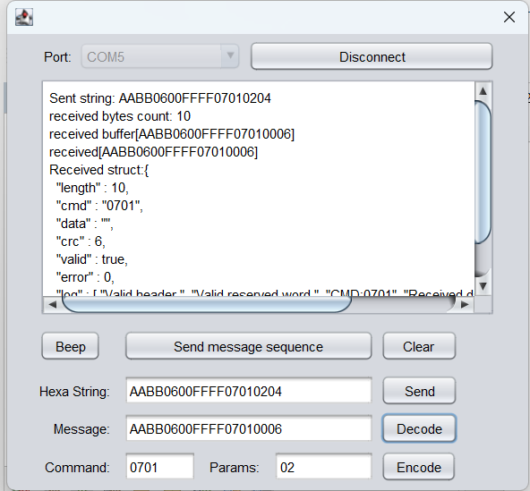

# ER302NFCReaderSwingApp
Sample JavaSE 25 Swing application for communicate with ER302 (YHY523U) over serial port (JSSC library).
Tested on Ubuntu Linux 17.10/24.04 and Windows 10/11.

# Build
Use maven: mvn clean package

# Run
target > java -jar ER302NFCReaderSwingApp-1.0-SNAPSHOT.jar

(sponsored by https://nfcshop.hu/)

